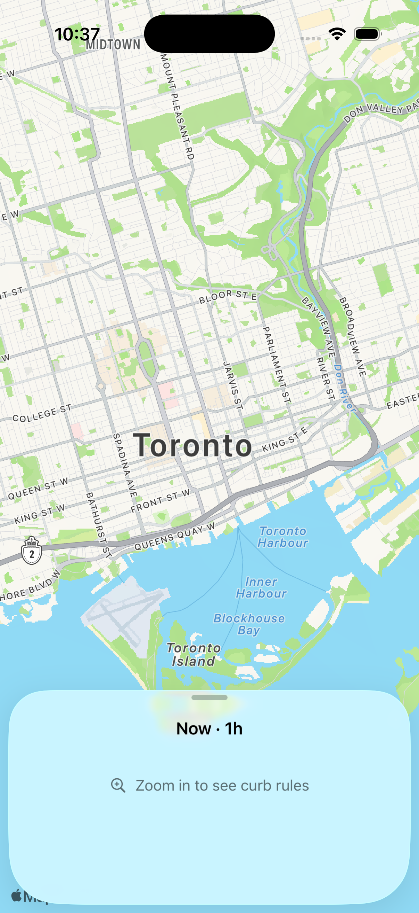
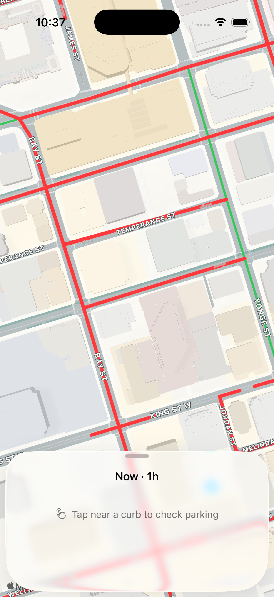

# Parkking iOS 🚗🅿️

A high-performance, offline-capable iOS app for navigating street parking rules, bylaw schedules, and real-time curb parking verdicts across Toronto.

<p align="center">
  
  &nbsp;&nbsp;&nbsp;&nbsp;
  
</p>

---

## Key Features

- **Offline-First Curb Bylaw Engine**: Parses and indexes tens of thousands of Toronto curb segments with zero network latency.
- **Instant Verdicts**: Tap any curb segment to see an immediate parking verdict (Allowed, Paid Parking, No Parking, No Standing, No Stopping, Permit Parking) evaluated against the selected date and time.
- **Time Selection & Presets**: Evaluate parking rules for "Right Now" or preview restrictions for future dates and times with quick presets.
- **High-Performance Map Rendering**: Viewport-subsetted `MKMapView` renderer grouping curb overlays into styled `MKMultiPolyline` batches for smooth 60/120 fps panning and zooming.
- **Zero Third-Party Dependencies**: Built 100% with native Apple SDKs (`SwiftUI`, `MapKit`, `CoreLocation`, `Combine`).

---

## Architecture Overview

```
Parkking/
├── App/
│   └── ParkkingApp.swift            # App entry point & test runner short-circuiting
├── Core/
│   ├── Data/
│   │   ├── ParkingDataStore.swift        # GeoJSON loading, snapshot hashing & caching
│   │   ├── ParkingGeoJSONDecoder.swift   # Fast streaming GeoJSON decoder
│   │   └── ParkingSpatialIndex.swift     # R-tree / grid spatial indexing for sub-50ms queries
│   ├── Schedule/
│   │   ├── ParkingTimeQuery.swift        # Time interval & query evaluation
│   │   ├── CurbVerdict.swift             # Allowed / Restricted verdict resolution
│   │   ├── BylawRule.swift               # Structured Toronto parking bylaw parser
│   │   └── OntarioPublicHolidays.swift   # Holiday exemption schedule calculator
│   ├── Geometry/
│   │   ├── CurbSelection.swift           # Hit-testing & nearest-segment resolution
│   │   └── SideNormalization.swift      # Left/Right street curb geometry alignment
│   └── Location/
│       ├── LocationClient.swift          # CoreLocation wrapper
│       ├── MapKitSearchClient.swift      # Location & address search autocompletion
│       └── RecentsStore.swift            # Search history persistence
├── Features/
│   └── ParkingMap/
│       ├── ParkingMapScreen.swift        # Main map view container
│       ├── ParkingMapViewModel.swift     # State management & viewport queries
│       ├── SearchCapsuleView.swift       # Search & time selection header
│       └── CurbVerdictSheet.swift        # Bottom sheet displaying verdict & bylaw quotes
└── Resources/
    ├── final_parking_map.geojson         # Pinned curb regulations dataset (~30MB)
    └── ontario_public_holidays.json      # Official Ontario public holiday calendar
```

---

## Requirements & Setup

### Prerequisites
- **macOS** 14.0 or newer
- **Xcode** 16.0 or newer
- **iOS Simulator**: iPhone 17 (iOS 18+ / 26.0+)

### Quickstart

1. **Clone the repository:**
   ```bash
   git clone https://github.com/JoeHershkie/parkking-ios.git
   cd parkking-ios
   ```

2. **Open in Xcode:**
   ```bash
   open Parkking.xcodeproj
   ```
   Select the **Parkking** scheme and run (`⌘R`) on an **iPhone 17** simulator.

3. **Or build from the command line:**
   ```bash
   # Pre-boot simulator
   make boot-sim

   # Build for testing
   make build
   ```

---

## Testing & Quality Gates

The project uses optimized test plans and custom test runners to ensure fast feedback during development.

| Command | Description | Typical Runtime |
| --- | --- | --- |
| `make test-fast` / `make test` | Runs fast unit test suite (`FastUnitTests.xctestplan`), skipping heavy dataset load gates | ~1-3s |
| `make test-only SUITE=<Name>` | Runs an isolated test class or specific test method | ~1s |
| `make test-all` | Runs all tests (`AllTests.xctestplan`), including 30MB dataset gates & performance checks | ~4-6s |

### Examples of Targeted Tests:
```bash
# Test bylaw schedule evaluation
make test-only SUITE=ScheduleCorpusTests

# Test curb verdict resolution
make test-only SUITE=CurbVerdictTests

# Test spatial index and tap selection
make test-only SUITE=CurbSelectionTests

# Test map view model
make test-only SUITE=ParkingMapViewModelTests
```

---

## Performance Targets

See [`docs/milestone-1/PERFORMANCE.md`](docs/milestone-1/PERFORMANCE.md) for full benchmark notes and hardware targets:

- **GeoJSON Decode & Spatial Indexing**: ≤ 3s on physical device / ~0.9s on simulator.
- **Indexed Tap Selection**: ≤ 50ms soft gate.
- **Overlay Rendering**: Native `MKMapView` multi-polyline batch renderer.
